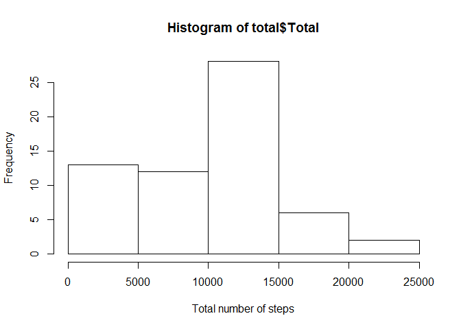
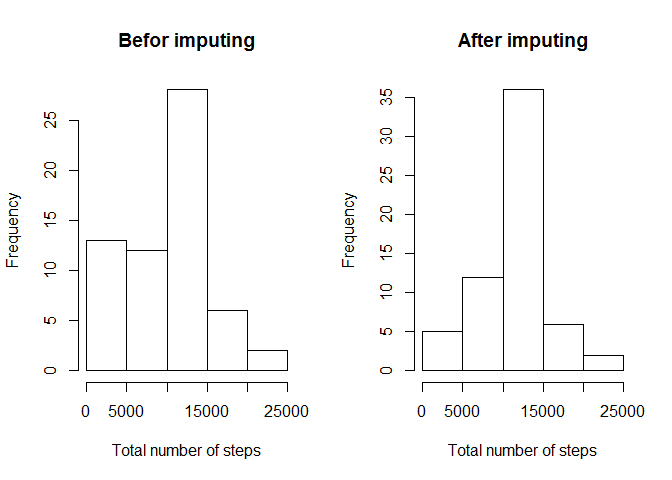
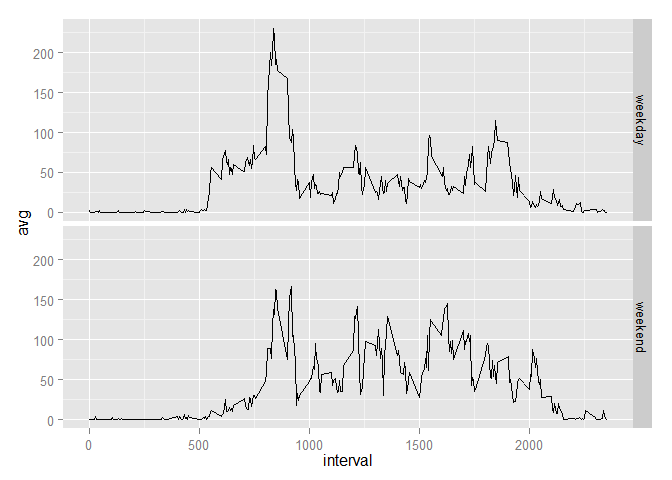

#Peer Assessment 1 - Reproducible Research

##Introduction

It is now possible to collect a large amount of data about personal movement using activity monitoring devices such as a Fitbit, Nike Fuelband, or Jawbone Up. These type of devices are part of the "quantified self" movement - a group of enthusiasts who take measurements about themselves regularly to improve their health, to find patterns in their behavior, or because they are tech geeks. But these data remain under-utilized both because the raw data are hard to obtain and there is a lack of statistical methods and software for processing and interpreting the data.

This assignment makes use of data from a personal activity monitoring device. This device collects data at 5 minute intervals through out the day. The data consists of two months of data from an anonymous individual collected during the months of October and November, 2012 and include the number of steps taken in 5 minute intervals each day.

###Loading and preprocessing the data
First thing we will need to do is load the activity data from activity.csv file into a dataframe, we will use the read.csv function to accomplish this task. Also we will convert the date from character into Date format.


```r
library(dplyr)
```

```
## 
## Attaching package: 'dplyr'
## 
## The following object is masked from 'package:stats':
## 
##     filter
## 
## The following objects are masked from 'package:base':
## 
##     intersect, setdiff, setequal, union
```

```r
data<-read.csv("activity.csv")
data<-mutate(data,date=as.Date(date,"%Y-%m-%d"))
```
###What is mean total number of steps taken per day?
To get the totals for dates we will group the data by date and then summarise to get the totals.
  

```r
total<- data %>%
    group_by(date) %>%
    summarise(Total=sum(steps,na.rm=TRUE))
```

1.Histogram of total number of steps

```r
hist(total$Total,xlab="Total number of steps")
```

 
  
2. To calculate the mean and median total number of steps taken per day we will summarize the total dataset.

```r
summary(total)
```

```
##       date                Total      
##  Min.   :2012-10-01   Min.   :    0  
##  1st Qu.:2012-10-16   1st Qu.: 6778  
##  Median :2012-10-31   Median :10395  
##  Mean   :2012-10-31   Mean   : 9354  
##  3rd Qu.:2012-11-15   3rd Qu.:12811  
##  Max.   :2012-11-30   Max.   :21194
```
  
From the summary we notice that the mean and median for total number of steps are 9353 and 10395.

###What is the average daily activity pattern?
To get the average daily pattern we will group the data by the interval and then get the total count of steps.

```r
avg<-data%>%
  group_by(interval) %>%
  summarise(avg=mean(steps,na.rm=TRUE))
```
1. Time series plot

```r
plot(avg$interval,avg$avg,type="l",xlab="Interval",ylab="Average # steps")
```

 
  
2.Which 5-minute interval, on average across all the days in the dataset, contains the maximum number of steps?

```r
avg$interval[which.max(avg$avg)]
```

```
## [1] 835
```
  

###Imputing missing values

1.Calculate and report the total number of missing values in the dataset (i.e. the total number of rows with NAs)

```r
sum(is.na(data$steps))
```

```
## [1] 2304
```

2.To clean the data for missing NA values in the steps column we will use the mean value for that interval.


3.Create a new dataset that is equal to the original dataset but with the missing data filled in.

```r
data.clean<-merge(data,avg,by="interval")
nas<-is.na(data.clean$steps)
data.clean$steps[nas]<-data.clean$avg[nas]
```
4.Make a histogram of the total number of steps taken each day and Calculate and report the mean and median total number of steps taken per day. Do these values differ from the estimates from the first part of the assignment? What is the impact of imputing missing data on the estimates of the total daily number of steps?

```r
total_new<- data.clean %>%
    group_by(date) %>%
    summarise(Total=sum(steps))
par(mfrow = c(1, 2))
hist(total$Total,xlab="Total number of steps",main="Befor imputing")
hist(total_new$Total,xlab="Total number of steps",main="After imputing")
```

 
  
*Mean and Median for total number of steps before imputing

```r
summary(total$Total)
```

```
##    Min. 1st Qu.  Median    Mean 3rd Qu.    Max. 
##       0    6778   10400    9354   12810   21190
```
*Mean and Median after imputing

```r
summary(total_new$Total)
```

```
##    Min. 1st Qu.  Median    Mean 3rd Qu.    Max. 
##      41    9819   10770   10770   12810   21190
```
From the summary data and histogram we can notice that the impact of imputing the data set on the overall outcome is low, one thing to notice is that the mean and median are the same for the imputed dataset.

###Are there differences in activity patterns between weekdays and weekends?
1.Create a new factor variable in the dataset with two levels - "weekday" and "weekend" indicating whether a given date is a weekday or weekend day

```r
dtype<-function(x) {
  
}
data.clean<-data.clean %>%
            mutate(daytype= ifelse(weekdays(date) %in% c("Saturday","Sunday"),
                                    "weekend","weekday")) %>%
            group_by(interval,daytype) %>%
            summarise(avg=mean(steps))
```
2.Make a panel plot containing a time series plot (i.e. type = "l") of the 5-minute interval (x-axis) and the average number of steps taken, averaged across all weekday days or weekend days (y-axis). 

```r
library(ggplot2)
qplot(interval,avg,geom="line",facets=daytype~.,data=data.clean)
```

 


